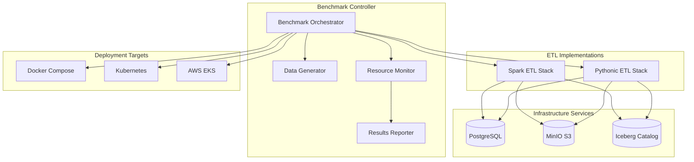

# Design Document

## Overview

The Modern Pythonic ETL Stack benchmark is designed as a comprehensive performance comparison framework that evaluates Python-native ETL tools (Polars, DuckDB, PyIceberg, PyArrow) against traditional Spark-based ETL pipelines. The system provides automated benchmarking across multiple environments (local Docker, Kubernetes, AWS) with detailed performance metrics collection and analysis.

The design emphasizes fair comparison through identical business logic implementation, comprehensive resource monitoring, and scalable test data generation. The benchmark framework generates actionable insights for technology stack selection decisions.

## Architecture

### High-Level Architecture



### Component Architecture

The system follows a modular architecture with clear separation of concerns:

1. **Benchmark Framework**: Orchestrates test execution, resource monitoring, and results collection
2. **ETL Implementations**: Two equivalent implementations using different technology stacks
3. **Infrastructure Services**: Shared data storage and catalog services
4. **Deployment Adapters**: Environment-specific deployment and monitoring logic

## Components and Interfaces

### Benchmark Controller

**Purpose**: Central orchestration of benchmark execution across different environments and configurations.

**Key Components**:
- `BenchmarkOrchestrator`: Main controller for test execution
- `EnvironmentManager`: Handles deployment target abstraction
- `ConfigurationManager`: Manages test parameters and scenarios
- `MetricsCollector`: Aggregates performance data from multiple sources

**Interfaces**:
```python
class BenchmarkController:
    def run_benchmark(self, config: BenchmarkConfig) -> BenchmarkResults
    def generate_test_data(self, size: DataSize, characteristics: DataCharacteristics) -> Dataset
    def deploy_environment(self, target: DeploymentTarget) -> Environment
    def collect_metrics(self, execution: ExecutionContext) -> PerformanceMetrics
```

### ETL Implementation Layer

**Spark ETL Stack**:
- **Technology**: PySpark + PyIceberg + distributed processing
- **Optimization**: Adaptive query execution, dynamic partition coalescing
- **Deployment**: Spark cluster with configurable executor instances

**Pythonic ETL Stack**:
- **Technology**: Polars + DuckDB + PyIceberg + PyArrow
- **Optimization**: Single-node memory optimization, vectorized operations
- **Deployment**: Single container with high memory allocation

**Common Interface**:
```python
class ETLProcessor:
    def process_data(self, input_path: str, output_path: str, config: ProcessingConfig) -> ProcessingResult
    def validate_output(self, output_path: str) -> ValidationResult
    def get_metrics(self) -> ProcessingMetrics
```

### Data Generation Engine

**Purpose**: Generate realistic test datasets with configurable characteristics for comprehensive benchmarking.

**Features**:
- **Scalable Data Generation**: Support for MB to GB scale datasets
- **Realistic Data Patterns**: Clickstream data with temporal patterns, IP distributions, user behavior simulation
- **Configurable Complexity**: Variable join complexity, aggregation requirements, data skew patterns
- **Format Support**: CSV, Parquet, JSON input formats

**Data Characteristics**:
```python
@dataclass
class DataCharacteristics:
    size: DataSize  # small (1MB-100MB), medium (100MB-1GB), large (1GB-10GB)
    complexity: ComplexityLevel  # simple, moderate, complex
    skew_factor: float  # 0.0 (uniform) to 1.0 (highly skewed)
    join_tables: int  # Number of additional tables for join operations
    temporal_range: timedelta  # Time span for temporal data
```

### Resource Monitoring System

**Purpose**: Comprehensive resource usage tracking across different deployment environments.

**Monitoring Capabilities**:
- **Container Metrics**: CPU usage, memory consumption, I/O statistics
- **Kubernetes Metrics**: Pod resource usage, node utilization, network traffic
- **Application Metrics**: Processing throughput, query execution times, error rates
- **Infrastructure Metrics**: Storage I/O, network latency, service response times

**Metrics Collection**:
```python
@dataclass
class PerformanceMetrics:
    execution_time: float
    startup_time: float
    peak_memory_mb: float
    avg_cpu_percent: float
    disk_io_mb: float
    network_io_mb: float
    throughput_records_per_sec: float
    error_count: int
```

### Results Analysis Engine

**Purpose**: Generate comprehensive analysis and recommendations from benchmark results.

**Analysis Features**:
- **Performance Comparison**: Side-by-side metrics comparison with statistical significance testing
- **Cost Analysis**: Infrastructure cost projections based on resource usage
- **Scalability Analysis**: Performance characteristics across different data sizes
- **Decision Framework**: Automated recommendations based on workload characteristics

## Data Models

### Benchmark Configuration

```python
@dataclass
class BenchmarkConfig:
    test_scenarios: List[TestScenario]
    deployment_targets: List[DeploymentTarget]
    data_sizes: List[DataSize]
    repetitions: int
    timeout_minutes: int
    resource_limits: ResourceLimits

@dataclass
class TestScenario:
    name: str
    etl_operations: List[ETLOperation]
    data_characteristics: DataCharacteristics
    validation_rules: List[ValidationRule]
```

### ETL Processing Models

```python
@dataclass
class ETLOperation:
    operation_type: OperationType  # filter, aggregate, join, transform
    complexity: ComplexityLevel
    selectivity: float  # Percentage of data retained after operation
    parameters: Dict[str, Any]

@dataclass
class ProcessingResult:
    output_path: str
    record_count: int
    processing_time: float
    validation_status: ValidationStatus
    metrics: ProcessingMetrics
```

### Results and Reporting Models

```python
@dataclass
class BenchmarkResults:
    test_id: str
    timestamp: datetime
    configuration: BenchmarkConfig
    stack_results: Dict[str, StackResult]
    comparative_analysis: ComparativeAnalysis
    recommendations: List[Recommendation]

@dataclass
class StackResult:
    stack_name: str
    execution_results: List[ExecutionResult]
    aggregated_metrics: AggregatedMetrics
    resource_efficiency: ResourceEfficiency
```

## Error Handling

### Error Categories and Strategies

**Infrastructure Errors**:
- **Container Startup Failures**: Retry with exponential backoff, fallback to alternative images
- **Resource Exhaustion**: Automatic resource scaling, graceful degradation
- **Network Connectivity**: Circuit breaker pattern, offline mode support

**Data Processing Errors**:
- **Data Corruption**: Checksum validation, automatic data regeneration
- **Schema Mismatches**: Schema evolution handling, backward compatibility checks
- **Processing Timeouts**: Configurable timeout handling, partial result preservation

**Benchmark Framework Errors**:
- **Metric Collection Failures**: Fallback to basic metrics, error reporting
- **Result Aggregation Errors**: Partial result handling, data integrity checks
- **Report Generation Failures**: Alternative output formats, raw data export

### Error Recovery Mechanisms

```python
class ErrorHandler:
    def handle_infrastructure_error(self, error: InfrastructureError) -> RecoveryAction
    def handle_processing_error(self, error: ProcessingError) -> RecoveryAction
    def handle_benchmark_error(self, error: BenchmarkError) -> RecoveryAction

    def retry_with_backoff(self, operation: Callable, max_retries: int) -> Result
    def fallback_to_alternative(self, primary_option: Option, fallback: Option) -> Result
```

## Testing Strategy

### Unit Testing

**ETL Logic Testing**:
- **Data Transformation Validation**: Verify identical output between Spark and Pythonic implementations
- **Edge Case Handling**: Null values, empty datasets, malformed data
- **Performance Regression**: Automated performance baseline comparison

**Framework Testing**:
- **Metric Collection Accuracy**: Validate resource monitoring precision
- **Configuration Validation**: Test parameter validation and error handling
- **Result Aggregation**: Verify statistical calculations and report generation

### Integration Testing

**End-to-End Pipeline Testing**:
- **Multi-Environment Deployment**: Validate deployment across Docker, Kubernetes, AWS
- **Data Flow Validation**: Verify data integrity through complete pipeline
- **Resource Monitoring Integration**: Test metric collection across all environments

**Infrastructure Testing**:
- **Service Dependencies**: Test Iceberg catalog, MinIO, PostgreSQL integration
- **Network Resilience**: Simulate network failures and recovery
- **Scaling Behavior**: Test horizontal and vertical scaling scenarios

### Performance Testing

**Benchmark Validation**:
- **Measurement Accuracy**: Validate timing precision and resource monitoring accuracy
- **Reproducibility**: Ensure consistent results across multiple runs
- **Statistical Significance**: Verify benchmark results meet statistical confidence thresholds

**Load Testing**:
- **Data Scale Testing**: Validate performance across different data sizes
- **Concurrent Execution**: Test multiple benchmark runs simultaneously
- **Resource Saturation**: Test behavior under resource constraints

### Acceptance Testing

**Business Scenario Validation**:
- **Real-World Workloads**: Test with production-like data patterns and volumes
- **Decision Framework Accuracy**: Validate recommendations against known optimal choices
- **Report Quality**: Verify report completeness and actionability

**User Experience Testing**:
- **Configuration Simplicity**: Test ease of benchmark setup and execution
- **Result Interpretation**: Validate clarity and usefulness of generated reports
- **Documentation Completeness**: Verify reproducibility from documentation alone

### Test Data Management

**Synthetic Data Generation**:
- **Realistic Patterns**: Generate data that mimics production characteristics
- **Scalable Generation**: Support for generating datasets from MB to GB scale
- **Deterministic Generation**: Ensure reproducible test data across runs

**Test Environment Management**:
- **Environment Isolation**: Ensure tests don't interfere with each other
- **Resource Cleanup**: Automatic cleanup of test artifacts and resources
- **Configuration Management**: Maintain test configurations and baselines
