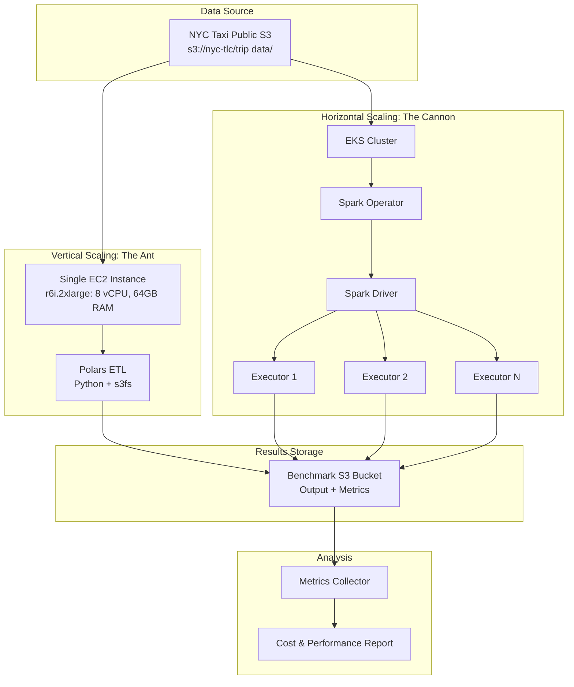
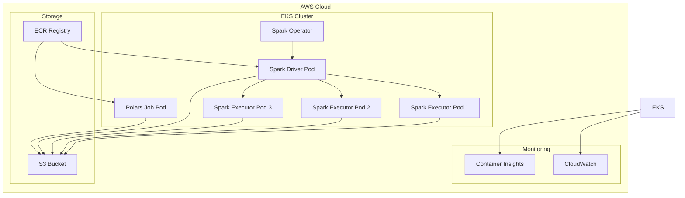

# Design Document

## Overview

The "Vertical vs. Horizontal Scaling" benchmark demonstrates when distributed processing becomes necessary by comparing single-node Polars (EC2) against distributed Spark (EKS). Using the real-world NYC Taxi dataset, we identify the **crossover point** where the complexity of distributed systems becomes justified.

**Key Design Principles:**

1. **Fair Comparison**: Identical ETL logic, same data source, same AWS region
2. **Real Data**: NYC Taxi public dataset (no synthetic data generation needed)
3. **Cost-Focused**: Track TCO including infrastructure, operational overhead, and execution time
4. **Narrative-Driven**: "Ant vs. Cannon" - when do you need the cannon?
5. **Production-Ready**: Both implementations use production-grade tools and best practices

**The Question We Answer:** At what data size does the operational complexity of Spark become worth it?

## Architecture

### High-Level Architecture: "Ant vs. Cannon"


```mermaid
graph TB
    subgraph "Data Source"
        NYC[NYC Taxi Public S3<br/>s3://nyc-tlc/trip data/]
    end

    subgraph "Vertical Scaling: The Ant"
        EC2[Single EC2 Instance<br/>r6i.2xlarge: 8 vCPU, 64GB RAM]
        POLARS[Polars ETL<br/>Python + s3fs]
    end

    subgraph "Horizontal Scaling: The Cannon"
        EKS[EKS Cluster]
        SO[Spark Operator]
        DRIVER[Spark Driver]
        EXEC1[Executor 1]
        EXEC2[Executor 2]
        EXEC3[Executor N]
    end

    subgraph "Results Storage"
        S3OUT[Benchmark S3 Bucket<br/>Output + Metrics]
    end

    subgraph "Analysis"
        METRICS[Metrics Collector]
        REPORT[Cost & Performance Report]
    end

    NYC --> EC2
    NYC --> EKS

    EC2 --> POLARS
    POLARS --> S3OUT

    EKS --> SO
    SO --> DRIVER
    DRIVER --> EXEC1
    DRIVER --> EXEC2
    DRIVER --> EXEC3
    EXEC1 --> S3OUT
    EXEC2 --> S3OUT
    EXEC3 --> S3OUT

    S3OUT --> METRICS
    METRICS --> REPORT
```

### Component Architecture

The system follows a modular architecture with clear separation of concerns:

1. **Data Source**: NYC Taxi public S3 bucket (no data generation needed)
2. **ETL Implementations**: Identical business logic in Polars (EC2) and Spark (EKS)
3. **Infrastructure**: EC2 for vertical scaling, EKS for horizontal scaling
4. **Metrics Collection**: CloudWatch for both EC2 and EKS monitoring
5. **Cost Analysis**: Automated TCO calculation including operational overhead

### NYC Taxi ETL Logic

Both implementations perform identical operations on the NYC Taxi dataset:

**1. Extract**
- Read Parquet files from `s3://nyc-tlc/trip data/`
- Support date range selection (1 month to 10 years)
- Handle schema evolution across years

**2. Transform**
- **Filter**: Remove invalid trips (passenger_count > 0, trip_distance > 0, fare_amount > 0)
- **Calculate**: price_per_mile = total_amount / trip_distance
- **Enrich**: Add date components (year, month, day, hour)
- **Clean**: Handle nulls and outliers

**3. Aggregate**
- Group by PULocationID (pickup location) and date
- Calculate: avg_fare, avg_distance, avg_price_per_mile, trip_count
- Sort by trip_count descending

**4. Load**
- Write results to benchmark S3 bucket as Parquet
- Include metadata: execution_time, record_count, data_size_gb

### AWS EKS Architecture


```mermaid
graph TB
    subgraph "AWS Cloud"
        subgraph "EKS Cluster"
            SO[Spark Operator]
            SD[Spark Driver Pod]
            SE1[Spark Executor Pod 1]
            SE2[Spark Executor Pod 2]
            SE3[Spark Executor Pod 3]
            PJ[Polars Job Pod]

            SO --> SD
            SD --> SE1
            SD --> SE2
            SD --> SE3
        end

        subgraph "Storage"
            S3[S3 Bucket]
            ECR[ECR Registry]
        end

        subgraph "Monitoring"
            CW[CloudWatch]
            CM[Container Insights]
        end
    end

    SD --> S3
    SE1 --> S3
    SE2 --> S3
    SE3 --> S3
    PJ --> S3

    EKS --> CW
    EKS --> CM

    ECR --> SD
    ECR --> PJ
```

**EKS Deployment Strategy**:
- **Spark Workloads**: Spark Operator manages SparkApplication CRDs with dynamic executor scaling
- **Data Access**: Read from public NYC Taxi S3 bucket, write to benchmark bucket
- **Authentication**: EKS Pod Identity Association (simpler than IRSA, no ServiceAccount annotations)
- **Container Images**: ECR for Docker image storage and versioning
- **Resource Monitoring**: CloudWatch Container Insights for pod-level metrics

**EC2 Deployment Strategy**:
- **Single Instance**: r6i.2xlarge or r6i.4xlarge (Graviton for cost savings)
- **Software**: Python 3.12, Polars, s3fs, boto3
- **Data Access**: Direct S3 read/write using IAM instance profile
- **Monitoring**: CloudWatch agent for instance metrics

## Components and Interfaces

### Benchmark Controller

**Purpose**: Central orchestration of benchmark execution across different environments and configurations.

**Key Components**:
- `BenchmarkOrchestrator`: Main controller for test execution
- `EnvironmentManager`: Handles deployment target abstraction
- `ConfigurationManager`: Manages test parameters and scenarios
- `MetricsCollector`: Aggregates performance data from multiple sources

**Interfaces**:
```python
class BenchmarkController:
    def run_benchmark(self, config: BenchmarkConfig) -> BenchmarkResults
    def generate_test_data(self, size: DataSize, characteristics: DataCharacteristics) -> Dataset
    def deploy_environment(self, target: DeploymentTarget) -> Environment
    def collect_metrics(self, execution: ExecutionContext) -> PerformanceMetrics
```

### ETL Implementation Layer

**Spark ETL Stack**:
- **Technology**: PySpark + PyIceberg + distributed processing
- **Optimization**: Adaptive query execution, dynamic partition coalescing
- **Deployment**: Spark cluster with configurable executor instances

**Pythonic ETL Stack**:
- **Technology**: Polars + DuckDB + PyIceberg + PyArrow
- **Optimization**: Single-node memory optimization, vectorized operations
- **Deployment**: Single container with high memory allocation

**Common Interface**:
```python
class ETLProcessor:
    def process_data(self, input_path: str, output_path: str, config: ProcessingConfig) -> ProcessingResult
    def validate_output(self, output_path: str) -> ValidationResult
    def get_metrics(self) -> ProcessingMetrics
```

### NYC Taxi Data Characteristics

**Data Source**: Public S3 bucket maintained by NYC TLC
- **Location**: `s3://nyc-tlc/trip data/`
- **Format**: Parquet (optimized for analytics)
- **Schema**: ~20 columns including timestamps, locations, fares, distances
- **Size**: ~100MB per file (monthly), ~1.2GB per year
- **Time Range**: 2009-present (15+ years of data)

**Data Sizes for Benchmarking**:
```python
@dataclass
class NYCTaxiDataset:
    name: str
    time_range: str
    file_count: int
    approx_size_gb: float
    approx_records: int

# Benchmark datasets
DATASETS = [
    NYCTaxiDataset("tiny", "2022-01 (1 month)", 1, 0.1, 3_000_000),
    NYCTaxiDataset("small", "2022 (1 year)", 12, 1.2, 40_000_000),
    NYCTaxiDataset("medium", "2020-2022 (3 years)", 36, 4.0, 120_000_000),
    NYCTaxiDataset("large", "2018-2022 (5 years)", 60, 10.0, 200_000_000),
    NYCTaxiDataset("xlarge", "2015-2022 (8 years)", 96, 50.0, 500_000_000),
    NYCTaxiDataset("xxlarge", "2009-2022 (14 years)", 168, 100.0, 1_000_000_000),
]
```

**Key Insight**: No data generation or upload needed - read directly from public bucket!

### Resource Monitoring System

**Purpose**: Comprehensive resource usage tracking across different deployment environments.

**Monitoring Capabilities**:
- **Container Metrics**: CPU usage, memory consumption, I/O statistics
- **Kubernetes Metrics**: Pod resource usage, node utilization, network traffic
- **Application Metrics**: Processing throughput, query execution times, error rates
- **Infrastructure Metrics**: Storage I/O, network latency, service response times

**Metrics Collection**:
```python
@dataclass
class PerformanceMetrics:
    execution_time: float
    startup_time: float
    peak_memory_mb: float
    avg_cpu_percent: float
    disk_io_mb: float
    network_io_mb: float
    throughput_records_per_sec: float
    error_count: int
```

### Results Analysis Engine

**Purpose**: Generate comprehensive analysis and recommendations from benchmark results.

**Analysis Features**:
- **Performance Comparison**: Side-by-side metrics comparison with statistical significance testing
- **Cost Analysis**: Infrastructure cost projections based on resource usage
- **Scalability Analysis**: Performance characteristics across different data sizes
- **Decision Framework**: Automated recommendations based on workload characteristics

## Data Models

### Benchmark Configuration

```python
@dataclass
class BenchmarkConfig:
    test_scenarios: List[TestScenario]
    deployment_targets: List[DeploymentTarget]
    data_sizes: List[DataSize]
    repetitions: int
    timeout_minutes: int
    resource_limits: ResourceLimits

@dataclass
class TestScenario:
    name: str
    etl_operations: List[ETLOperation]
    data_characteristics: DataCharacteristics
    validation_rules: List[ValidationRule]
```

### ETL Processing Models

```python
@dataclass
class ETLOperation:
    operation_type: OperationType  # filter, aggregate, join, transform
    complexity: ComplexityLevel
    selectivity: float  # Percentage of data retained after operation
    parameters: Dict[str, Any]

@dataclass
class ProcessingResult:
    output_path: str
    record_count: int
    processing_time: float
    validation_status: ValidationStatus
    metrics: ProcessingMetrics
```

### Results and Reporting Models

```python
@dataclass
class BenchmarkResults:
    test_id: str
    timestamp: datetime
    configuration: BenchmarkConfig
    stack_results: Dict[str, StackResult]
    comparative_analysis: ComparativeAnalysis
    recommendations: List[Recommendation]

@dataclass
class StackResult:
    stack_name: str
    execution_results: List[ExecutionResult]
    aggregated_metrics: AggregatedMetrics
    resource_efficiency: ResourceEfficiency
```

## Error Handling

### Error Categories and Strategies

**Infrastructure Errors**:
- **Container Startup Failures**: Retry with exponential backoff, fallback to alternative images
- **Resource Exhaustion**: Automatic resource scaling, graceful degradation
- **Network Connectivity**: Circuit breaker pattern, offline mode support

**Data Processing Errors**:
- **Data Corruption**: Checksum validation, automatic data regeneration
- **Schema Mismatches**: Schema evolution handling, backward compatibility checks
- **Processing Timeouts**: Configurable timeout handling, partial result preservation

**Benchmark Framework Errors**:
- **Metric Collection Failures**: Fallback to basic metrics, error reporting
- **Result Aggregation Errors**: Partial result handling, data integrity checks
- **Report Generation Failures**: Alternative output formats, raw data export

### Error Recovery Mechanisms

```python
class ErrorHandler:
    def handle_infrastructure_error(self, error: InfrastructureError) -> RecoveryAction
    def handle_processing_error(self, error: ProcessingError) -> RecoveryAction
    def handle_benchmark_error(self, error: BenchmarkError) -> RecoveryAction

    def retry_with_backoff(self, operation: Callable, max_retries: int) -> Result
    def fallback_to_alternative(self, primary_option: Option, fallback: Option) -> Result
```

## Testing Strategy

### Unit Testing

**ETL Logic Testing**:
- **Data Transformation Validation**: Verify identical output between Spark and Pythonic implementations
- **Edge Case Handling**: Null values, empty datasets, malformed data
- **Performance Regression**: Automated performance baseline comparison

**Framework Testing**:
- **Metric Collection Accuracy**: Validate resource monitoring precision
- **Configuration Validation**: Test parameter validation and error handling
- **Result Aggregation**: Verify statistical calculations and report generation

### Integration Testing

**End-to-End Pipeline Testing**:
- **Multi-Environment Deployment**: Validate deployment across Docker, Kubernetes, AWS
- **Data Flow Validation**: Verify data integrity through complete pipeline
- **Resource Monitoring Integration**: Test metric collection across all environments

**Infrastructure Testing**:
- **Service Dependencies**: Test Iceberg catalog, MinIO, PostgreSQL integration
- **Network Resilience**: Simulate network failures and recovery
- **Scaling Behavior**: Test horizontal and vertical scaling scenarios

### Performance Testing

**Benchmark Validation**:
- **Measurement Accuracy**: Validate timing precision and resource monitoring accuracy
- **Reproducibility**: Ensure consistent results across multiple runs
- **Statistical Significance**: Verify benchmark results meet statistical confidence thresholds

**Load Testing**:
- **Data Scale Testing**: Validate performance across different data sizes
- **Concurrent Execution**: Test multiple benchmark runs simultaneously
- **Resource Saturation**: Test behavior under resource constraints

### Acceptance Testing

**Business Scenario Validation**:
- **Real-World Workloads**: Test with production-like data patterns and volumes
- **Decision Framework Accuracy**: Validate recommendations against known optimal choices
- **Report Quality**: Verify report completeness and actionability

**User Experience Testing**:
- **Configuration Simplicity**: Test ease of benchmark setup and execution
- **Result Interpretation**: Validate clarity and usefulness of generated reports
- **Documentation Completeness**: Verify reproducibility from documentation alone

### Test Data Management

**Synthetic Data Generation**:
- **Realistic Patterns**: Generate data that mimics production characteristics
- **Scalable Generation**: Support for generating datasets from MB to GB scale
- **Deterministic Generation**: Ensure reproducible test data across runs

**Test Environment Management**:
- **Environment Isolation**: Ensure tests don't interfere with each other
- **Resource Cleanup**: Automatic cleanup of test artifacts and resources
- **Configuration Management**: Maintain test configurations and baselines

## AWS EKS Deployment Design

### Infrastructure as Code

**Terraform Modules**:
```hcl
# EKS Cluster with node groups
module "eks" {
  cluster_name = "etl-benchmark-cluster"
  node_groups = {
    spark_workers: r6i.2xlarge (8 vCPU, 64GB)
    polars_workers: r6i.8xlarge (32 vCPU, 256GB)
  }
}

# S3 Bucket for data storage
module "s3" {
  bucket_name = "etl-benchmark-data-${account_id}"
  versioning = enabled
  lifecycle_rules = intelligent_tiering
}

# ECR Repository for container images
module "ecr" {
  repositories = ["spark-etl", "polars-etl"]
  image_scanning = enabled
}
```

### Spark Operator Configuration with Pod Identity

**EKS Pod Identity Association** (Simpler than IRSA):
```hcl
# Terraform configuration
resource "aws_eks_pod_identity_association" "spark" {
  cluster_name    = module.eks.cluster_name
  namespace       = "default"
  service_account = "spark-sa"
  role_arn        = aws_iam_role.spark_pods.arn
}
```

**Benefits over IRSA**:
- No OIDC provider configuration needed
- No ServiceAccount annotations required
- Simpler IAM trust policy
- Better security isolation
- Easier to manage at scale

**SparkApplication CRD**:
```yaml
apiVersion: sparkoperator.k8s.io/v1beta2
kind: SparkApplication
metadata:
  name: spark-etl-benchmark
spec:
  type: Python
  mode: cluster
  image: ${ECR_REPO}/spark-etl:${VERSION}
  mainApplicationFile: local:///app/src/etl/spark_etl_nyc_taxi.py

  sparkConf:
    spark.hadoop.fs.s3a.impl: org.apache.hadoop.fs.s3a.S3AFileSystem
    # Pod Identity handles credentials automatically
    spark.hadoop.fs.s3a.aws.credentials.provider: com.amazonaws.auth.WebIdentityTokenCredentialsProvider

  driver:
    cores: 2
    memory: "4g"
    serviceAccount: spark-sa  # Associated with IAM role via Pod Identity

  executor:
    cores: 4
    memory: "8g"
    instances: 3
```

### NYC Taxi Data Access Strategy

**Input Data** (No upload needed!):
```
s3://nyc-tlc/trip data/
├── yellow_tripdata_2022-01.parquet  # ~100MB, 3M records
├── yellow_tripdata_2022-02.parquet
├── ...
└── yellow_tripdata_2009-01.parquet  # Historical data back to 2009
```

**Output Data** (Benchmark results):
```
s3://etl-benchmark-results-${account_id}/
├── polars/
│   ├── tiny/
│   │   ├── results.parquet
│   │   └── metrics.json
│   ├── small/
│   ├── medium/
│   └── large/
└── spark/
    ├── tiny/
    ├── small/
    ├── medium/
    └── large/
```

**Cost Savings**:
- No data generation compute needed
- No S3 upload costs
- No S3 storage costs for input data
- Only pay for output storage (minimal)

### Cost Tracking and Optimization

**EC2 Cost Model (Polars)**:
```python
ec2_cost = (instance_hourly_rate × execution_hours) + s3_requests_cost
# Example: r6i.2xlarge = $0.504/hr in us-east-1
# 10GB processing in 5 minutes = $0.042 + $0.001 S3 = $0.043 total
```

**EKS Cost Model (Spark)**:
```python
eks_cost = (
    (control_plane_cost × hours) +  # $0.10/hr
    (node_costs × hours) +           # Multiple nodes
    (s3_requests_cost)
)
# Example: 3 nodes × $0.504/hr × 0.5hr = $0.756 + $0.05 control + $0.002 S3 = $0.808
```

**TCO Analysis**:
- **Operational Overhead**: Deployment time, monitoring setup, debugging complexity
- **Learning Curve**: Time to become proficient with each approach
- **Maintenance**: Ongoing operational burden

**Optimization Strategies**:
- **Graviton Instances**: r7g vs r6i = 20% cost savings
- **Spot Instances**: 60-90% savings for non-critical workloads
- **Right-Sizing**: Start small, scale only when needed
- **No Data Transfer**: Reading from public bucket in same region = free
