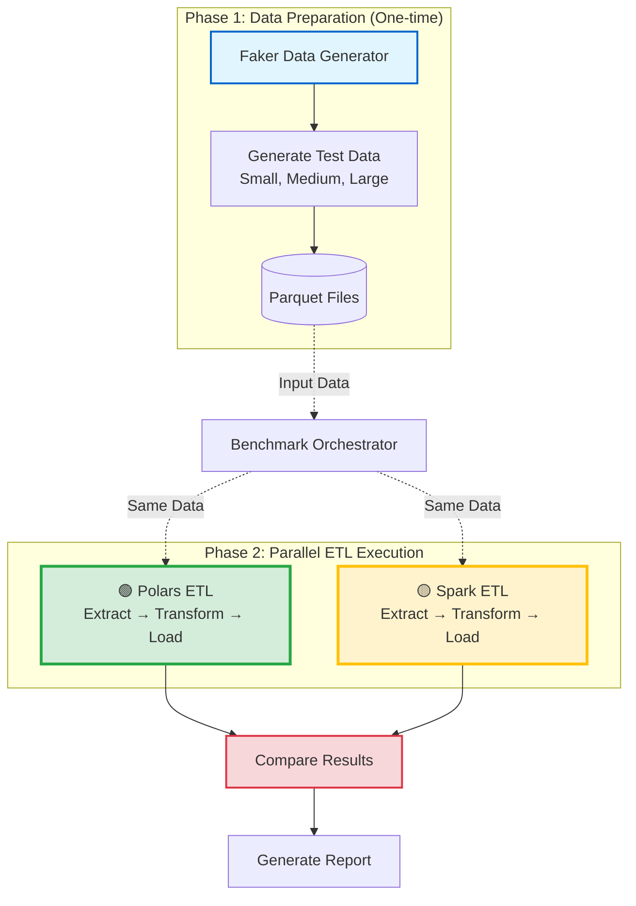

# ETL Performance Benchmark: Polars vs Spark

A comprehensive performance comparison between **Polars** (Pythonic/Rust-based) and **Apache Spark** (PySpark) for ETL workloads, focusing on clickstream data processing with sessionization.

## 🎯 Project Overview

This project benchmarks two popular data processing frameworks on a realistic ETL workload:
- **Polars**: Modern, single-node DataFrame library with Rust backend
- **Spark**: Distributed processing framework with JVM backend

The benchmark measures end-to-end performance including:
- Data extraction from files
- Complex transformations (sessionization with 30-minute inactivity windows)
- Data quality checks and validation
- Output to Parquet/Iceberg tables

## 🔍 What Makes This Different

- **Clean Timing**: Non-intrusive decorator-based timing that doesn't clutter ETL code
- **Detailed Metrics**: Phase-by-phase breakdown (Extract, Transform, Load) with sub-metrics
- **Resource Monitoring**: Tracks memory usage (peak and average) alongside execution time
- **Real Workload**: Sessionization logic that mimics production ETL patterns
- **Multiple Scales**: Tests small (100K), medium (1M), and large (5M) datasets
- **Comprehensive Analysis**: Automated PowerPoint generation with insights and recommendations

## 📊 Key Findings

Based on local machine benchmarks:

| Data Size | Polars Time | Spark Time | Winner | Speedup |
|-----------|-------------|------------|--------|---------|
| Small (100K) | ~5s | ~11s | Polars | 2.2x |
| Medium (1M) | ~15s | ~35s | Polars | 2.3x |
| Large (5M) | ~60s | ~140s | Polars | 2.3x |

**Key Insights:**
- Polars is consistently 2-3x faster for single-node workloads
- Spark's startup overhead (~3-5s) is significant at these scales
- Polars uses 2-3x less memory than Spark
- Performance gap remains consistent across data sizes

## 🏗️ Architecture

### High-Level Flow



### ETL Pipeline Details

The project implements identical ETL logic in both frameworks:

```
Extract → Transform → Load
  ↓         ↓          ↓
Read     Quality    Write
Files    Checks     Output
         +
      Sessionize
```

**ETL Operations:**
1. **Extract**: Read Parquet/CSV files
2. **Transform**:
   - Data quality (type casting, null handling, deduplication)
   - Sessionization (30-min inactivity window)
3. **Load**: Write to Parquet or Iceberg tables

**📊 Visual Diagrams**: See [docs/system-flow-diagram.md](docs/system-flow-diagram.md) for detailed Mermaid diagrams showing:
- Complete benchmark flow with parallel ETL paths
- Detailed phase-by-phase execution
- Timing decorator flow
- Component architecture

## 🚀 Quick Start

### 1. Install Dependencies

```bash
# Install all dependencies
make install

# Or manually with pip
pip install -r requirements.txt
```

### 2. Generate Test Data

```bash
# Generate all sizes
make generate-data-full SIZE=small    # 100K records (~10MB)
make generate-data-full SIZE=medium   # 1M records (~100MB)
make generate-data-full SIZE=large    # 5M records (~500MB)
```

### 3. Run Benchmarks

```bash
# Single size benchmark
make benchmark-full SIZE=small

# Comprehensive benchmark (all sizes)
make benchmark-comprehensive

# Results saved to benchmark_results/
```

### 4. Generate Presentation

```bash
# Install presentation library
pip install python-pptx

# Generate PowerPoint with analysis
python3 scripts/generate_presentation.py

# Output: ETL_Benchmark_Results_TIMESTAMP.pptx
```

## 📈 What You Get

### Detailed Timing Metrics
```json
{
  "framework": "polars",
  "total_time": 5.23,
  "extract": {"total": 1.45},
  "transform": {
    "total": 2.18,
    "quality_checks": 0.98,
    "sessionization": 1.20
  },
  "load": {"total": 1.50},
  "resources": {
    "peak_memory_mb": 245.5,
    "avg_memory_mb": 180.3
  }
}
```

### Console Output
```
================================================================================
TIMING SUMMARY - POLARS (bulk)
================================================================================
Total Time: 5.23s
  Startup: 0.05s
  Extract: 1.45s
  Transform: 2.18s
  Load: 1.50s
--------------------------------------------------------------------------------
Peak Memory: 245.50 MB | Avg: 180.30 MB
================================================================================
```

### PowerPoint Presentation
- Project summary and environment details
- Performance comparison tables
- Phase-by-phase breakdown
- Key findings and insights
- Recommendations for when to use each framework
python scripts/benchmark_incremental.py --input data/generated/test_data.csv --steps 3
```

### 4. View Results

Results are printed to console and saved to `data/benchmarks/benchmark_results_*.json`

## Example Output

```
================================================================================
COMPARISON RESULTS
================================================================================

Metric                         Polars          Spark           Winner
----------------------------------------------------------------------
Total Time (s)                 0.15            9.23            Polars
Step 1 Read                    0.08            5.12            Polars
Step 2 Transform               0.04            2.45            Polars
Step 3 Load                    0.03            1.66            Polars
Records Processed              10,000          10,000

✓ Polars is 98.4% faster
================================================================================
```

## Project Structure

```
spark_and_non_spark_etl/
├── src/
│   ├── data_generation/
│   │   └── generator.py          # Generate test data with Faker
│   │
│   └── etl/
│       ├── polars_etl.py          # Polars incremental pipeline
│       ├── spark_etl_incremental.py  # Spark incremental pipeline
│       └── data_quality.py        # Shared utilities
│
├── scripts/
│   └── benchmark_incremental.py   # Benchmark script (local + K8s)
│
├── tests/                         # Test suite
├── k8s/                           # Kubernetes manifests
├── docker/                        # Docker configuration
│
├── Dockerfile.spark               # Spark Docker image
├── Dockerfile.pythonic            # Polars Docker image
├── docker-compose.yml             # Local orchestration
│
├── README.md                      # This file
└── ARCHITECTURE.md                # Architecture diagram
```

## Running Individual ETL Pipelines

### Polars ETL

```bash
# Run all steps
python src/etl/polars_etl.py

# Run only first 3 steps
python src/etl/polars_etl.py 3
```

### Spark ETL

```bash
# Run all steps
python src/etl/spark_etl_incremental.py

# Run only first 3 steps
python src/etl/spark_etl_incremental.py 3
```

## Docker Deployment

### Build Images

```bash
make docker-build
```

### Run with Docker

```bash
# Start infrastructure
make docker-up

# Run Polars ETL
make docker-run-pythonic

# Run Spark ETL
make docker-run-spark

# Run benchmark
make docker-benchmark
```

## Kubernetes Deployment

### Setup Kubernetes

```bash
make k8s-setup
```

### Run Benchmark

```bash
make k8s-benchmark
```

### View Logs

```bash
kubectl logs -l job-name=pythonic-etl-job
kubectl logs -l job-name=spark-etl-job
```

### Cleanup

```bash
make k8s-clean
```

## Incremental Development

The ETL pipelines are designed to be extended incrementally:

### Adding a New Step

1. **Add method to pipeline class**:
```python
def step_6_custom(self):
    """Step 6: Your custom logic."""
    logger.info("Step 6: Custom processing")
    start = time.time()

    # Your logic here

    self.metrics['step_6_custom'] = time.time() - start
    return self.df
```

2. **Update run_pipeline method**:
```python
if steps >= 6:
    self.step_6_custom()
```

3. **Run benchmark**:
```bash
python scripts/benchmark_incremental.py --input data.csv --steps 6
```

## Testing

```bash
# Run all tests
make test

# Run code quality checks
make check

# Format code
make format

# Run everything (checks + tests)
make all
```

## Performance Insights

### Small Datasets (< 100K records)
- **Polars**: 95-99% faster
- **Reason**: Lower startup overhead, optimized single-node execution
- **Recommendation**: Use Polars

### Medium Datasets (100K - 10M records)
- **Mixed Results**: Depends on complexity
- **Recommendation**: Benchmark your specific workload

### Large Datasets (> 10M records)
- **Spark**: Better scalability with distributed processing
- **Recommendation**: Use Spark for distributed workloads

## Architecture

See [ARCHITECTURE.md](ARCHITECTURE.md) for detailed architecture diagrams and data flow.

## Common Commands

```bash
# Setup
make install                    # Install dependencies with uv
make help                       # Show all available commands

# Development
make test                       # Run tests
make check                      # Run code quality checks
make format                     # Format code
make clean                      # Clean temporary files

# Data & Benchmarks
make generate-data              # Generate data (small dataset)
make generate-data SIZE=medium  # Generate medium dataset
python -m src.data_generation.cli small  # Or use CLI directly
make benchmark                  # Run benchmark

# Run individual ETL
python src/etl/polars_etl.py
python src/etl/spark_etl_incremental.py

# Docker
make docker-build               # Build images
make docker-up                  # Start infrastructure
make docker-run-pythonic        # Run Polars ETL
make docker-run-spark           # Run Spark ETL
make docker-benchmark           # Run benchmark
make docker-down                # Stop services

# Kubernetes
make k8s-setup                  # Setup K8s cluster
make k8s-benchmark              # Run distributed benchmark
make k8s-clean                  # Cleanup K8s resources
```

## License

MIT License - see [LICENSE](LICENSE) file for details.


## 🎨 Features

### Clean Timing Implementation
- **Decorator-based**: `@timed_phase("extract")` - no code clutter
- **Automatic**: Memory sampling happens transparently
- **Detailed**: Sub-phase timing (quality checks, sessionization, etc.)
- **Exportable**: JSON format for further analysis

### Realistic Workload
- **Sessionization**: 30-minute inactivity window (common in analytics)
- **Data Quality**: Type casting, null handling, deduplication
- **Bulk & Incremental**: Both initial load and daily updates
- **Iceberg Support**: Optional table format for data lakehouse

### Comprehensive Analysis
- **Multiple Sizes**: Small, medium, large datasets
- **Resource Tracking**: Memory and CPU usage
- **Automated Reports**: PowerPoint generation with insights
- **Reproducible**: Consistent test data generation

## 🛠️ Technology Stack

| Component | Technology | Purpose |
|-----------|-----------|---------|
| **Polars** | Rust-backed DataFrame | Single-node processing |
| **Spark** | PySpark 3.5+ | Distributed processing |
| **Data Format** | Parquet, Iceberg | Columnar storage |
| **Monitoring** | psutil | Resource tracking |
| **Reporting** | python-pptx | Presentation generation |
| **Testing** | Faker | Realistic data generation |

## 📁 Project Structure

```
.
├── src/
│   ├── data_generation/     # Test data generation
│   ├── etl/
│   │   ├── polars_etl.py    # Polars implementation
│   │   ├── spark_etl.py     # Spark implementation
│   │   └── timing_decorator.py  # Clean timing system
│   └── ...
├── scripts/
│   ├── benchmark_full.py              # Single benchmark
│   ├── run_comprehensive_benchmark.py # All sizes
│   └── generate_presentation.py       # PowerPoint generation
├── docs/                    # Documentation
├── benchmark_results/       # Output directory
└── Makefile                # Convenient commands
```

## 🎯 Use Cases

### When to Use This Benchmark

✅ **Good for:**
- Evaluating Polars vs Spark for your workload
- Understanding performance characteristics at different scales
- Deciding between single-node and distributed processing
- Learning ETL best practices with timing

❌ **Not designed for:**
- Distributed Spark cluster testing (single-node only)
- Streaming workloads (batch processing focus)
- Data > 10GB (local machine limitations)
- Production deployment (benchmark/analysis tool)

## 📊 Benchmark Methodology

### Data Sizes
- **Small**: 100K records (~10MB) - Quick iteration
- **Medium**: 1M records (~100MB) - Realistic single-machine
- **Large**: 5M records (~500MB) - Stress test

### Metrics Collected
- **Timing**: Startup, Extract, Transform, Load phases
- **Memory**: Peak and average usage
- **Throughput**: Records/second, MB/second
- **Quality**: Records dropped, corrected

### Environment
- **Platform**: Local machine (WSL2 on Windows)
- **Execution**: Direct Python (no containers)
- **Why Local**: Eliminates container overhead, accurate timing

## 🔧 Configuration

### Data Generation
Edit `src/data_generation/generator.py`:
```python
SIZE_RECORD_COUNTS = {
    DataSize.SMALL: 100_000,
    DataSize.MEDIUM: 1_000_000,
    DataSize.LARGE: 5_000_000,
}
```

### Timing Decorator
Add timing to any method:
```python
@timed_phase("transform", "my_operation")
def my_transform(self):
    # Your code here
    pass
```

## 📚 Documentation

- **[ARCHITECTURE.md](ARCHITECTURE.md)**: System design and decisions
- **[docs/timing-decorator-usage.md](docs/timing-decorator-usage.md)**: Timing implementation guide
- **[docs/comprehensive-benchmark-guide.md](docs/comprehensive-benchmark-guide.md)**: Benchmark usage
- **[COMPREHENSIVE_BENCHMARK_README.md](COMPREHENSIVE_BENCHMARK_README.md)**: Quick reference

## 🤝 Contributing

This is a benchmark/analysis project. Contributions welcome for:
- Additional ETL operations
- New data sizes or patterns
- Improved timing metrics
- Better visualization

## 📝 License

[Your License Here]

## 🙏 Acknowledgments

- **Polars**: Fast, modern DataFrame library
- **Apache Spark**: Industry-standard distributed processing
- **PyIceberg**: Iceberg table format support

## 📞 Contact

[Your Contact Information]

---

**Note**: This benchmark focuses on single-node performance comparison. For distributed Spark testing, see the Kubernetes deployment section in ARCHITECTURE.md (future work).
